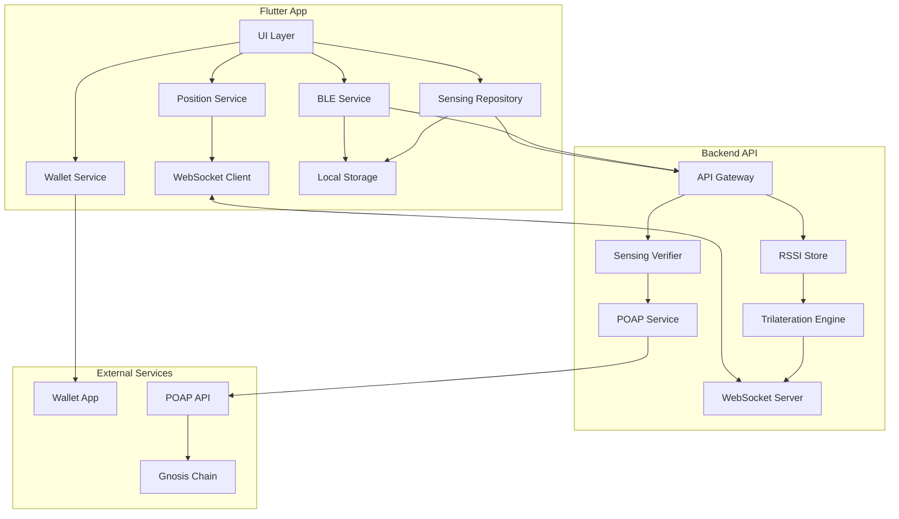
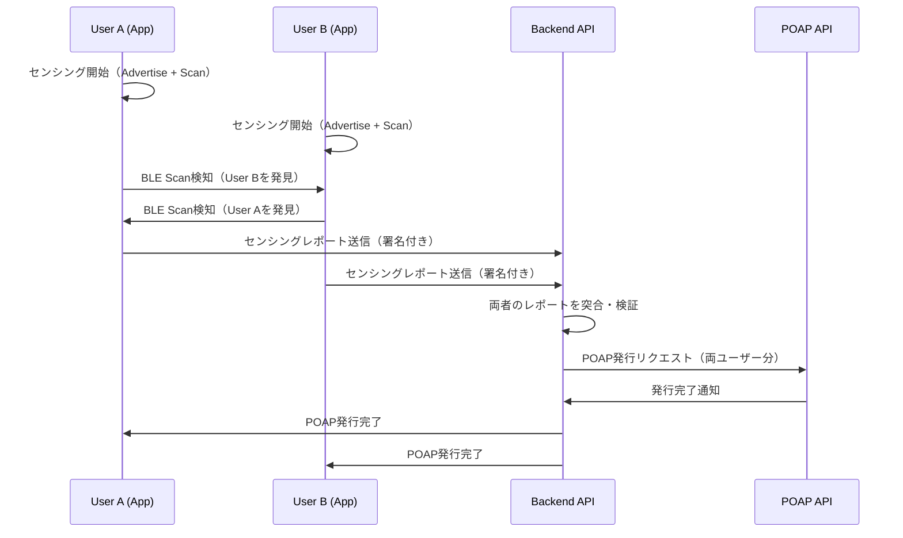
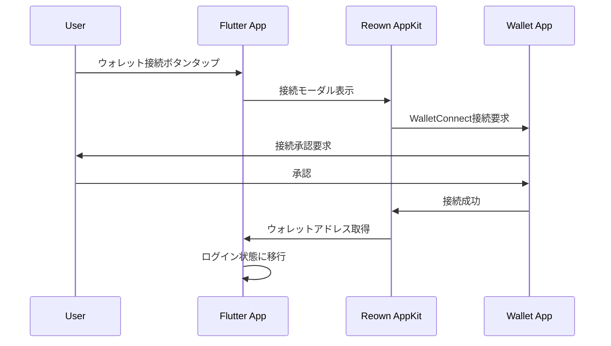
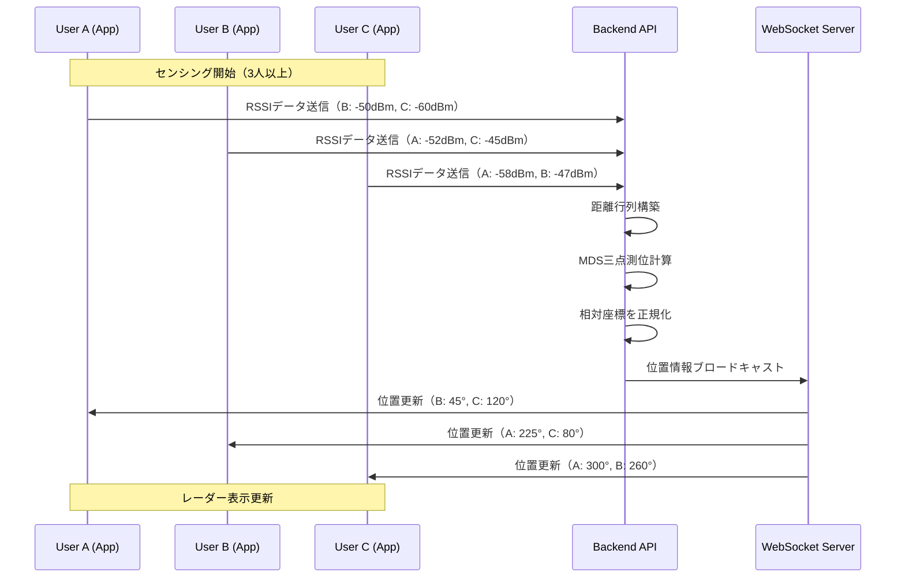
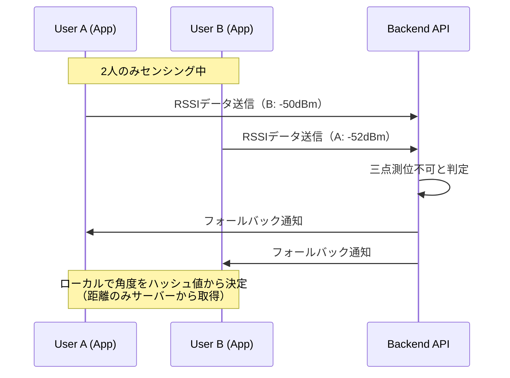
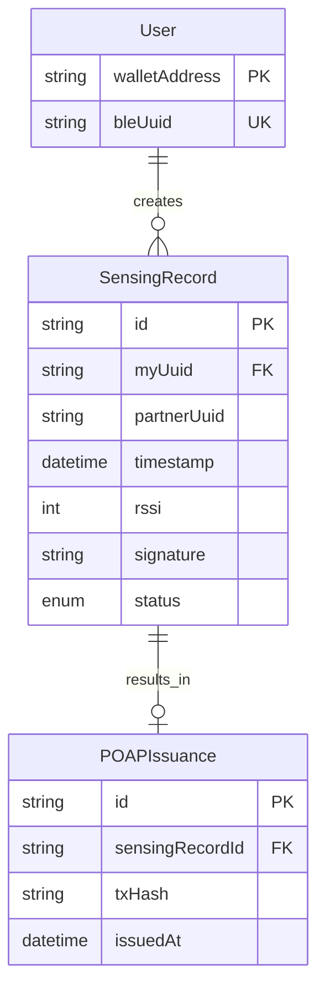

# Technical Design Document

## Overview

**Purpose**: 本フィーチャーは、BLE（Bluetooth Low Energy）を使用してユーザー間の相互センシングを実現し、その証明としてPOAPを発行するFlutterモバイルアプリを提供する。

**Users**: イベント参加者、コミュニティメンバーがリアルな出会いの証跡をブロックチェーン上に記録するために使用する。

**Impact**: 新規Flutterアプリとバックエンドサービスを構築し、BLE近接検知とPOAP NFT発行を連携させる。

### Goals
- BLEによるユーザー間の相互近接検知を実現する
- 検証可能なセンシングデータに基づきPOAPを発行する
- WalletConnect経由でウォレット接続を提供する
- シンプルで直感的なUIを実現する
- 三点測位による相対位置可視化を実現する（3人以上の場合）
- リアルタイム同期によるユーザー位置の即時更新

### Non-Goals
- バックグラウンドでの常時センシング（バッテリー消費考慮）
- POAP自体のアプリ内表示（外部POAPアプリに委譲）
- オフライン時のPOAP発行（ネットワーク接続必須）
- UWBによる高精度距離測定（BLE RSSIのみ使用）
- 絶対座標系での位置測定（相対位置のみ）

## Architecture

### Architecture Pattern & Boundary Map



**Architecture Integration**:
- **Selected Pattern**: レイヤードアーキテクチャ + ハイブリッド型（クライアント-サーバー）
- **Domain Boundaries**: BLEサービス、ウォレットサービス、センシングリポジトリを分離
- **Rationale**: BLE処理、ブロックチェーン連携、データ永続化の責務を明確に分離し、テスト容易性と保守性を確保

### Technology Stack

| Layer | Choice / Version | Role in Feature | Notes |
|-------|------------------|-----------------|-------|
| Frontend | Flutter 3.38.4 | クロスプラットフォームUI | iOS/Android対応 |
| BLE | 独自BLEライブラリ（別リポジトリ） | スキャン+アドバタイズ（Central/Peripheral両対応） | barnard library |
| Wallet | reown_appkit (AppKit) | WalletConnect連携 | 旧web3modal_flutter |
| Local Storage | hive_ce | センシング履歴永続化 | 高速NoSQL、暗号化対応 |
| WebSocket (Client) | web_socket_channel | リアルタイム位置同期 | 標準Flutter WebSocket |
| Backend | Node.js / Express | API提供、POAP連携 | Vercel/Railway等にデプロイ可 |
| WebSocket (Server) | ws | リアルタイム位置配信 | Node.js WebSocket |
| Trilateration | 自前実装 | 三点測位アルゴリズム | MDS (多次元尺度構成法) |
| Blockchain | Gnosis Chain | POAP発行先 | 低ガス代 |

## System Flows

### センシング〜POAP発行フロー



### ウォレット接続フロー



### 三点測位・リアルタイム位置同期フロー



### 2人以下の場合のフォールバックフロー



## Requirements Traceability

| Requirement | Summary | Components | Interfaces | Flows |
|-------------|---------|------------|------------|-------|
| 1.1 | センシング開始時にBLEアドバタイズ+スキャン開始 | BLEService | BLEServiceInterface | センシングフロー |
| 1.2 | センシング停止時にBLE停止 | BLEService | BLEServiceInterface | - |
| 1.3 | 他ユーザー検知時にデバイスID・RSSI取得 | BLEService | DetectedDevice | センシングフロー |
| 1.4, 1.5 | BLE無効/パーミッション未許可時のエラー処理 | BLEService, UI | BLEStatus | - |
| 2.1 | 検知情報の一時保存 | SensingRepository | SensingRecord | センシングフロー |
| 2.2 | 相互センシング成立の記録 | SensingRepository, Backend | MutualSensingResult | センシングフロー |
| 2.3 | 検証中インジケータ表示 | UI | SensingState | - |
| 2.4 | タイムスタンプ付与 | SensingRepository | SensingRecord | - |
| 3.1 | センシングデータのスマコン送信 | Backend | SensingReportAPI | POAP発行フロー |
| 3.2 | 検証合格時にPOAP発行 | Backend, POAPService | POAPMintAPI | POAP発行フロー |
| 3.3 | POAP発行完了通知 | UI, Backend | POAPResult | POAP発行フロー |
| 3.4, 3.5 | 検証/発行失敗時のエラー表示 | UI | ErrorState | - |
| 3.6 | POAP表示は外部アプリ | - | - | - |
| 4.1 | センシング開始/停止ボタン | HomeScreen, SensingButton | - | - |
| 4.2 | センシング状態表示 | HomeScreen, RadarView | - | - |
| 4.3 | レーダービューでユーザー表示 | RadarView | - | - |
| 4.4 | 履歴一覧表示 | HistoryScreen | - | - |
| 4.5 | POAP発行ステータス表示 | HistoryScreen | - | - |
| 4.6 | ヘッダー左端に履歴ボタン（検知数表示） | HistoryHeaderButton | - | - |
| 4.7 | ヘッダー右端にマイページボタン | MyPageHeaderButton | - | - |
| 4.8 | ボトムナビゲーション廃止 | HomeScreen | - | - |
| 4.9 | ヘッダーにサービス名表示なし | HomeScreen | - | - |
| 5.1-5.3 | ローカルストレージ | SensingRepository | HiveBox | - |
| 6.1-6.6 | ウォレット接続 | WalletService | WalletState | ウォレット接続フロー |
| 7.1 | 3人以上で三点測位計算 | TrilaterationEngine | PositionData | 三点測位フロー |
| 7.2 | 計算された角度で表示 | RadarView, PositionService | UserPosition | 三点測位フロー |
| 7.3 | 3人未満でフォールバック | RadarPainter | - | フォールバックフロー |
| 7.4 | RSSI定期収集 | BLEService, Backend | RSSIReport | 三点測位フロー |
| 7.5 | WebSocket位置配信 | WebSocketServer | PositionBroadcast | 三点測位フロー |
| 7.6 | 計算失敗時フォールバック | RadarView | - | フォールバックフロー |
| 8.1 | WebSocket接続維持 | WebSocketClient | - | リアルタイム同期 |
| 8.2 | 他ユーザー検知通知 | WebSocketServer | DetectionNotify | リアルタイム同期 |
| 8.3 | 位置情報再配信 | TrilaterationEngine | PositionBroadcast | リアルタイム同期 |
| 8.4 | WebSocket自動再接続 | WebSocketClient | - | - |
| 8.5 | オフライン時ローカル表示 | RadarPainter | - | フォールバックフロー |
| 9.1 | 履歴ボタンタップで履歴ページ遷移 | HistoryHeaderButton, HistoryScreen | - | - |
| 9.2 | 履歴ページにデバッグリンク | HistoryScreen | - | - |
| 9.3 | 履歴ページに戻るナビゲーション | HistoryScreen | - | - |
| 10.1 | マイページボタン（未接続時）でウォレット接続 | MyPageHeaderButton | - | ウォレット接続フロー |
| 10.2 | マイページボタン（接続済）でマイページ遷移 | MyPageHeaderButton, MyPageScreen | - | - |
| 10.3 | マイページにウォレットアドレス表示 | MyPageScreen | - | - |
| 10.4 | マイページにウォレット切断ボタン | MyPageScreen | - | - |
| 10.5 | マイページに戻るナビゲーション | MyPageScreen | - | - |

## Components and Interfaces

| Component | Domain/Layer | Intent | Req Coverage | Key Dependencies | Contracts |
|-----------|--------------|--------|--------------|------------------|-----------|
| BLEService | Service | BLEスキャン・アドバタイズ管理 | 1.1-1.5, 7.4 | 独自BLEライブラリ (P0) | Service |
| WalletService | Service | ウォレット接続管理 | 6.1-6.6 | reown_appkit (P0) | Service, State |
| SensingRepository | Data | センシングデータ管理 | 2.1-2.4, 5.1-5.3 | hive_ce (P0), Backend API (P1) | Service |
| PositionService | Service | 位置情報管理・WebSocket連携 | 7.2, 8.1, 8.4 | WebSocketClient (P0) | Service, State |
| WebSocketClient | Infra | WebSocket接続管理 | 8.1, 8.4 | web_socket_channel (P0) | Client |
| BackendAPI | Backend | センシング検証・POAP発行 | 3.1-3.5 | POAP API (P0) | API |
| RSSICollector | Backend | RSSIデータ収集・保存 | 7.4 | - | API |
| TrilaterationEngine | Backend | 三点測位計算 | 7.1, 7.6, 8.3 | - | Algorithm |
| WebSocketServer | Backend | リアルタイム位置配信 | 7.5, 8.2 | ws (P0) | Server |
| HomeScreen | UI | メイン画面 | 4.1-4.3, 4.6-4.9 | BLEService, WalletService (P0) | State |
| RadarView | UI | レーダー表示 | 7.2, 7.3, 7.6, 8.5 | PositionService (P0) | Widget |
| HistoryScreen | UI | 履歴画面 | 4.4-4.5, 9.1-9.3 | SensingRepository (P0) | State |
| MyPageScreen | UI | マイページ | 10.2-10.5 | WalletService (P0) | State |
| DebugScreen | UI | デバッグ画面 | 9.2 | BLEService, PermissionService (P0) | State |
| HistoryHeaderButton | UI | 履歴ヘッダーボタン | 4.6, 9.1 | - | Widget |
| MyPageHeaderButton | UI | マイページヘッダーボタン | 4.7, 10.1, 10.2 | WalletService (P0) | Widget |

### Service Layer

#### BLEService

| Field | Detail |
|-------|--------|
| Intent | BLEスキャンとアドバタイズを統合管理し、近接デバイスの検知を提供 |
| Requirements | 1.1, 1.2, 1.3, 1.4, 1.5 |

**Responsibilities & Constraints**
- BLEスキャン（Central Role）とアドバタイズ（Peripheral Role）の同時制御
- デバイス固有のUUID生成・管理（ウォレットアドレス由来）
- BLE状態（有効/無効）とパーミッション状態の監視

**Dependencies**
- External: 独自BLEライブラリ — BLEスキャン+アドバタイズ (P0)
- Inbound: WalletService — UUID生成用アドレス取得 (P1)

**Contracts**: Service [x] / State [x]

##### Service Interface
```dart
abstract class BLEServiceInterface {
  /// BLE状態ストリーム
  Stream<BLEStatus> get statusStream;

  /// 検知デバイスストリーム
  Stream<List<DetectedDevice>> get detectedDevicesStream;

  /// センシング開始
  Future<Result<void, BLEError>> startSensing({required String userUuid});

  /// センシング停止
  Future<Result<void, BLEError>> stopSensing();

  /// パーミッション要求
  Future<Result<bool, BLEError>> requestPermissions();
}

enum BLEStatus {
  unknown,
  unsupported,
  unauthorized,
  poweredOff,
  poweredOn,
  scanning,
}

class DetectedDevice {
  final String uuid;
  final int rssi;
  final DateTime detectedAt;
}

sealed class BLEError {
  const BLEError();
}
class BLEUnsupportedError extends BLEError {}
class BLEUnauthorizedError extends BLEError {}
class BLEPoweredOffError extends BLEError {}
class BLEUnknownError extends BLEError {
  final String message;
  const BLEUnknownError(this.message);
}
```

##### State Management
```dart
class BLEState {
  final BLEStatus status;
  final bool isScanning;
  final bool isAdvertising;
  final List<DetectedDevice> detectedDevices;
  final String? userUuid;
}
```

**Implementation Notes**
- 独自BLEライブラリがスキャン・アドバタイズ両方を提供、本アプリはそのインターフェースを使用
- 独自ライブラリの開発進捗に合わせてインターフェース定義を調整する可能性あり
- iOS: Info.plistにNSBluetoothAlwaysUsageDescription設定必須
- Android: AndroidManifest.xmlにBLUETOOTH_SCAN, BLUETOOTH_ADVERTISE, ACCESS_FINE_LOCATION権限追加

---

#### WalletService

| Field | Detail |
|-------|--------|
| Intent | WalletConnect経由のウォレット接続・切断を管理 |
| Requirements | 6.1, 6.2, 6.3, 6.4, 6.5, 6.6 |

**Responsibilities & Constraints**
- Reown AppKitを使用したウォレット接続モーダル制御
- 接続状態とウォレットアドレスの永続化
- セッション切断時の状態クリア

**Dependencies**
- External: reown_appkit — WalletConnect連携 (P0)
- External: flutter_secure_storage — アドレス永続化 (P1)

**Contracts**: Service [x] / State [x]

##### Service Interface
```dart
abstract class WalletServiceInterface {
  /// ウォレット接続状態ストリーム
  Stream<WalletState> get stateStream;

  /// 現在の接続状態
  WalletState get currentState;

  /// 接続モーダル表示・接続開始
  Future<Result<String, WalletError>> connect();

  /// 切断
  Future<Result<void, WalletError>> disconnect();

  /// メッセージ署名（センシングレポート署名用）
  Future<Result<String, WalletError>> signMessage(String message);
}

class WalletState {
  final bool isConnected;
  final String? address;
  final String? chainId;
}

sealed class WalletError {
  const WalletError();
}
class WalletUserRejectedError extends WalletError {}
class WalletConnectionFailedError extends WalletError {
  final String message;
  const WalletConnectionFailedError(this.message);
}
```

**Implementation Notes**
- Reown Project IDをReownダッシュボードから取得し環境変数で管理
- Gnosis Chain（chainId: 100）をサポートチェーンとして設定

---

#### SensingRepository

| Field | Detail |
|-------|--------|
| Intent | センシング履歴のローカル永続化とバックエンド同期を管理 |
| Requirements | 2.1, 2.2, 2.3, 2.4, 5.1, 5.2, 5.3 |

**Responsibilities & Constraints**
- 検知情報の一時保存とタイムスタンプ付与
- 相互センシング成立時のバックエンドAPI呼び出し
- 履歴データのHiveへの永続化

**Dependencies**
- External: hive_ce — ローカルストレージ (P0)
- Outbound: BackendAPI — センシング検証 (P1)

**Contracts**: Service [x]

##### Service Interface
```dart
abstract class SensingRepositoryInterface {
  /// センシング履歴ストリーム
  Stream<List<SensingRecord>> get historyStream;

  /// 検知情報を一時保存
  Future<void> saveDetection(DetectedDevice device, String myUuid);

  /// 相互センシング検証をバックエンドに送信
  Future<Result<MutualSensingResult, SensingError>> verifyMutualSensing({
    required String myUuid,
    required String partnerUuid,
    required DateTime timestamp,
    required String signature,
  });

  /// 履歴取得
  Future<List<SensingRecord>> getHistory();

  /// 古い履歴のクリーンアップ
  Future<void> cleanupOldRecords({required Duration olderThan});
}

class SensingRecord {
  final String id;
  final String myUuid;
  final String partnerUuid;
  final DateTime timestamp;
  final SensingStatus status;
  final String? poapTxHash;
}

enum SensingStatus {
  detected,
  verifying,
  verified,
  poapIssued,
  failed,
}

class MutualSensingResult {
  final bool isVerified;
  final String? poapTxHash;
  final String? errorMessage;
}
```

---

### Backend Layer

#### BackendAPI

| Field | Detail |
|-------|--------|
| Intent | センシングデータの検証とPOAP発行を実行 |
| Requirements | 3.1, 3.2, 3.3, 3.4, 3.5 |

**Responsibilities & Constraints**
- 両ユーザーのセンシングレポートを突合検証
- 署名検証によるなりすまし防止
- POAP API経由でのNFT発行

**Dependencies**
- External: POAP API — NFT発行 (P0)

**Contracts**: API [x]

##### API Contract

| Method | Endpoint | Request | Response | Errors |
|--------|----------|---------|----------|--------|
| POST | /api/sensing/report | SensingReportRequest | SensingReportResponse | 400, 401, 500 |
| GET | /api/sensing/status/:id | - | SensingStatusResponse | 404, 500 |
| POST | /api/rssi/report | RSSIReportRequest | RSSIReportResponse | 400, 500 |
| WS | /ws | - | PositionUpdate (stream) | - |

```typescript
// Request
interface SensingReportRequest {
  userUuid: string;
  walletAddress: string;
  partnerUuid: string;
  timestamp: string; // ISO 8601
  rssi: number;
  signature: string; // EIP-191 personal_sign
}

// Response
interface SensingReportResponse {
  reportId: string;
  status: 'pending' | 'verified' | 'poap_issued' | 'failed';
  poapTxHash?: string;
  errorMessage?: string;
}

interface SensingStatusResponse {
  reportId: string;
  status: 'pending' | 'verified' | 'poap_issued' | 'failed';
  partnerAddress?: string;
  poapTxHash?: string;
  createdAt: string;
  updatedAt: string;
}

// RSSI Report (for trilateration)
interface RSSIReportRequest {
  userId: string; // displayId
  detectedUsers: {
    userId: string;
    rssi: number;
    timestamp: string;
  }[];
}

interface RSSIReportResponse {
  success: boolean;
  activeUsers: number;
  trilaterationEnabled: boolean;
}

// WebSocket Messages
interface WSMessage {
  type: 'position_update' | 'user_joined' | 'user_left' | 'fallback_mode';
  payload: PositionUpdate | UserEvent | FallbackNotice;
}

interface PositionUpdate {
  userId: string;
  positions: {
    targetUserId: string;
    angle: number;      // 0-360 degrees
    distance: number;   // 0-1 normalized
    rssi: number;
  }[];
  timestamp: string;
}

interface UserEvent {
  userId: string;
  action: 'joined' | 'left';
}

interface FallbackNotice {
  reason: 'insufficient_users' | 'calculation_failed';
  activeUsers: number;
}
```

**Implementation Notes**
- センシングレポートはタイムウィンドウ（例: 5分以内）で突合
- 署名検証: ethers.jsでrecoverAddressを使用
- POAP APIキーはサーバー環境変数で管理

---

#### TrilaterationEngine

| Field | Detail |
|-------|--------|
| Intent | RSSIデータから三点測位で相対位置を計算 |
| Requirements | 7.1, 7.6, 8.3 |

**Responsibilities & Constraints**
- 距離行列からMDS（多次元尺度構成法）で2D座標を計算
- 3人以上のユーザーが必要、2人以下はフォールバック
- 計算結果を各ユーザー視点での相対角度に変換

**Dependencies**
- Inbound: RSSICollector — 距離行列データ (P0)
- Outbound: WebSocketServer — 位置情報配信 (P0)

**Contracts**: Algorithm [x]

##### Algorithm Interface
```typescript
interface TrilaterationEngine {
  // 距離行列から2D座標を計算
  calculatePositions(distanceMatrix: DistanceMatrix): Position2D[] | null;

  // 特定ユーザー視点での相対角度を計算
  calculateRelativeAngles(
    positions: Position2D[],
    viewerUserId: string
  ): RelativePosition[];
}

interface DistanceMatrix {
  userIds: string[];
  distances: number[][]; // userIds.length x userIds.length
}

interface Position2D {
  userId: string;
  x: number;
  y: number;
}

interface RelativePosition {
  targetUserId: string;
  angle: number;    // 0-360 degrees (0 = right, 90 = up)
  distance: number; // normalized 0-1
}
```

**Algorithm Notes**
- MDS (Classical Multidimensional Scaling) を使用
  1. 距離行列Dを二重中心化してグラム行列Bを作成
  2. Bの固有値分解で2次元座標を取得
  3. 座標を正規化（最大距離を1に）
- RSSIから距離への変換: `distance = 10^((TxPower - RSSI) / (10 * n))`
  - TxPower: 1mでの参照RSSI（-59dBm想定）
  - n: 環境係数（2.0〜4.0、デフォルト2.5）

---

#### PositionService (Flutter)

| Field | Detail |
|-------|--------|
| Intent | WebSocket経由で位置情報を受信しUIに提供 |
| Requirements | 7.2, 8.1, 8.4 |

**Responsibilities & Constraints**
- WebSocket接続の確立と維持
- 位置更新イベントをストリームで提供
- 接続断時の自動再接続（指数バックオフ）

**Dependencies**
- External: web_socket_channel — WebSocket通信 (P0)
- Inbound: BLEService — ユーザーID取得 (P1)

**Contracts**: Service [x] / State [x]

##### Service Interface
```dart
abstract class PositionServiceInterface {
  /// 接続状態ストリーム
  Stream<PositionConnectionState> get connectionStateStream;

  /// 位置更新ストリーム
  Stream<PositionUpdate> get positionUpdateStream;

  /// 三点測位有効状態
  Stream<bool> get trilaterationEnabledStream;

  /// 接続開始
  Future<Result<void, PositionError>> connect(String userId);

  /// 切断
  Future<void> disconnect();

  /// RSSIデータ送信
  Future<Result<void, PositionError>> sendRSSIReport(
    List<DetectedUserRSSI> detectedUsers,
  );
}

enum PositionConnectionState {
  disconnected,
  connecting,
  connected,
  reconnecting,
}

class PositionUpdate {
  final String userId;
  final List<UserPosition> positions;
  final DateTime timestamp;
}

class UserPosition {
  final String targetUserId;
  final double angle;    // radians
  final double distance; // 0-1
  final int rssi;
}

class DetectedUserRSSI {
  final String userId;
  final int rssi;
  final DateTime timestamp;
}

sealed class PositionError {
  const PositionError();
}
class PositionConnectionError extends PositionError {
  final String message;
  const PositionConnectionError(this.message);
}
class PositionTimeoutError extends PositionError {}
```

##### State Management
```dart
class PositionServiceState {
  final PositionConnectionState connectionState;
  final bool trilaterationEnabled;
  final Map<String, UserPosition> positions; // targetUserId -> position
  final DateTime? lastUpdate;
}
```

---

### UI Layer

#### HomeScreen

| Field | Detail |
|-------|--------|
| Intent | メイン画面でセンシング操作とレーダービューを提供 |
| Requirements | 4.1, 4.2, 4.3, 4.6, 4.7, 4.8, 4.9 |

**State Management**
```dart
class HomeScreenState {
  final BLEStatus bleStatus;
  final bool isSensing;
  final List<DetectedDevice> nearbyUsers;
  final WalletState walletState;
  final bool isLoading;
  final String? errorMessage;
}
```

**Implementation Notes**
- センシング開始/停止ボタンは目立つFABとして画面下部中央に配置
- ボトムナビゲーションは使用しない（シングルページレイアウト）
- メインコンテンツはレーダービュー
- ヘッダー構成:
  - 左端: 履歴ボタン（円形、内部に検知ユーザー数を表示）
  - 中央: なし（サービス名を表示しない）
  - 右端: マイページボタン（円形アバターアイコン）

---

#### MyPageScreen

| Field | Detail |
|-------|--------|
| Intent | ユーザープロフィールとウォレット管理を提供 |
| Requirements | 10.2, 10.3, 10.4, 10.5 |

**State Management**
```dart
class MyPageScreenState {
  final WalletState walletState;
  final bool isDisconnecting;
}
```

**Implementation Notes**
- ウォレット接続済みの場合のみ表示（未接続時はHomeScreenでモーダル表示）
- ウォレットアドレスを全文表示
- 切断ボタンをプロミネントに配置
- AppBarに戻るボタンを配置

##### UI Structure
```
MyPageScreen
├── AppBar
│   ├── BackButton
│   └── Title: "マイページ"
└── Content
    ├── AvatarIcon (large)
    ├── WalletAddress (full)
    └── DisconnectButton
```

---

#### HistoryHeaderButton

| Field | Detail |
|-------|--------|
| Intent | 検知履歴ページへのナビゲーションと検知数表示を兼ねるボタン |
| Requirements | 4.6, 9.1 |

**Implementation Notes**
- 円形ボタン（CircleAvatar または Container with BoxDecoration）
- 内部に検知ユーザー数を表示（Text）
- タップで検知履歴ページに遷移
- センシング中は数字を動的に更新

```dart
class HistoryHeaderButton extends StatelessWidget {
  final int detectedCount;
  final VoidCallback onPressed;
}
```

---

#### MyPageHeaderButton

| Field | Detail |
|-------|--------|
| Intent | マイページへのナビゲーションまたはウォレット接続を兼ねるボタン |
| Requirements | 4.7, 10.1, 10.2 |

**Implementation Notes**
- 円形アバターアイコンボタン
- ウォレット未接続時: タップでウォレット接続モーダルを表示
- ウォレット接続済み時: タップでマイページに遷移
- 接続状態に応じてアイコン/スタイルを変更

```dart
class MyPageHeaderButton extends StatelessWidget {
  final bool isWalletConnected;
  final VoidCallback onPressed;
}
```

---

#### DebugScreen

| Field | Detail |
|-------|--------|
| Intent | 開発者向けデバッグ情報を表示 |
| Requirements | 9.1 |

**Implementation Notes**
- 既存のデバッグビュー（ステータスカード、検知ユーザーリスト）を独立画面として分離
- 設定ページから遷移
- AppBarに戻るボタンを配置

---

#### HistoryScreen

| Field | Detail |
|-------|--------|
| Intent | センシング履歴とPOAP発行ステータスを表示、デバッグ画面への導線を提供 |
| Requirements | 4.4, 4.5, 9.1, 9.2, 9.3 |

**State Management**
```dart
class HistoryScreenState {
  final List<SensingRecord> history;
  final bool isLoading;
  final SensingRecord? selectedRecord;
}
```

**Implementation Notes**
- 履歴アイテムタップで詳細ボトムシート表示
- POAP発行ステータスをアイコン/色で視覚化
- ホーム画面のヘッダー左端ボタンから遷移
- デバッグ画面へのリンクをAppBarのアクションまたはリスト項目として提供
- AppBarに戻るボタンを配置

---

## Data Models

### Domain Model



### Logical Data Model

**SensingRecord（Hive Box）**
- `id`: String (UUID v4)
- `myUuid`: String
- `partnerUuid`: String
- `timestamp`: DateTime
- `rssi`: int
- `status`: enum (detected, verifying, verified, poapIssued, failed)
- `poapTxHash`: String?
- `createdAt`: DateTime
- `updatedAt`: DateTime

**Indexes**:
- Primary: `id`
- Secondary: `timestamp` (履歴の時系列クエリ用)

---

## Error Handling

### Error Categories and Responses

**User Errors (4xx)**
- BLE無効 → 設定画面への誘導ダイアログ
- パーミッション拒否 → 再要求ボタン付きメッセージ
- ウォレット接続拒否 → 再接続ボタン付きメッセージ

**System Errors (5xx)**
- バックエンドAPI障害 → リトライボタン + ローカルキューイング
- POAP API障害 → ステータス「発行待ち」として後続リトライ

**Business Logic Errors (422)**
- 相互センシング未成立 → 「相手がまだ検知していません」表示
- 署名検証失敗 → 「認証エラー」表示

### Monitoring
- Sentry/Crashlyticsでクラッシュ・エラー監視
- バックエンドでセンシング検証成功率、POAP発行成功率をメトリクス化

---

## Testing Strategy

### Unit Tests
- BLEService: スキャン/アドバタイズ状態遷移
- WalletService: 接続/切断フロー
- SensingRepository: 履歴CRUD操作
- 署名検証ロジック

### Integration Tests
- BLEService + ble_peripheral統合動作
- SensingRepository + BackendAPI連携
- WalletService + reown_appkit連携

### E2E Tests
- センシング開始→検知→POAP発行の完全フロー
- ウォレット接続→センシング→履歴確認フロー

---

## Security Considerations

- **署名検証**: センシングレポートにウォレット署名を付与し、バックエンドで検証
- **APIキー保護**: POAP APIキーはバックエンドのみで管理、クライアントに露出しない
- **ローカルデータ暗号化**: hive_ceの暗号化機能を使用（オプション）
- **なりすまし対策**: BLE UUIDはウォレットアドレスから派生し、署名で真正性担保

---

## Performance & Scalability

- **BLEスキャン間隔**: バランスモード（flutter_reactive_bleデフォルト）でバッテリー消費を抑制
- **バックエンドスケーリング**: サーバーレス（Vercel Functions/AWS Lambda）で自動スケール
- **ローカルストレージ**: Hiveの高速読み書きで履歴表示のレスポンス確保
