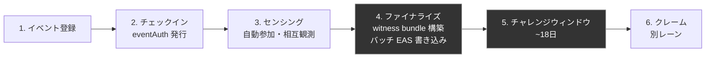
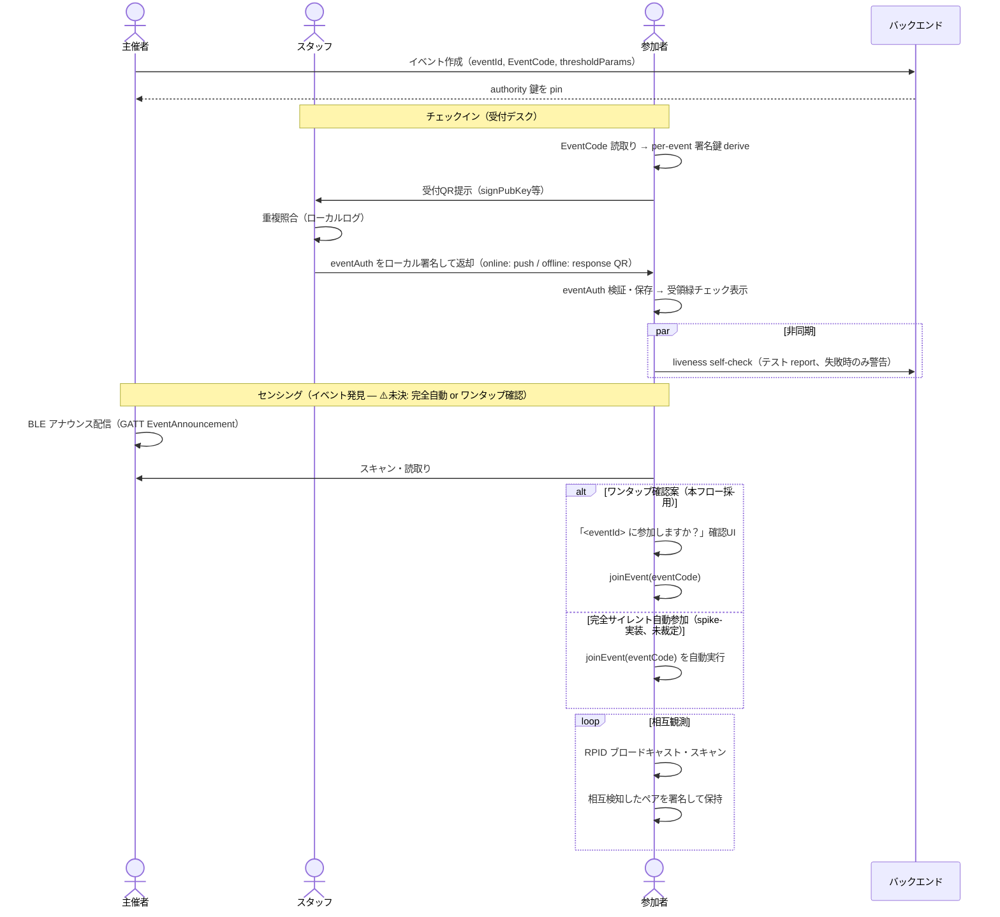
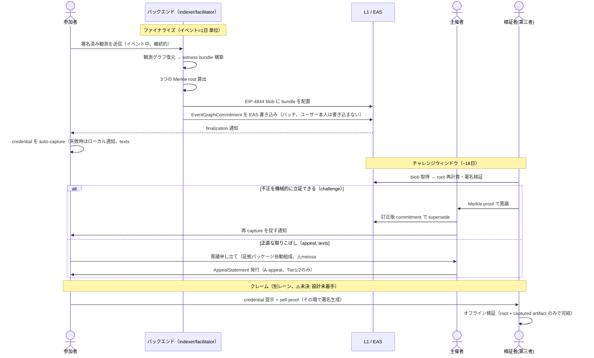
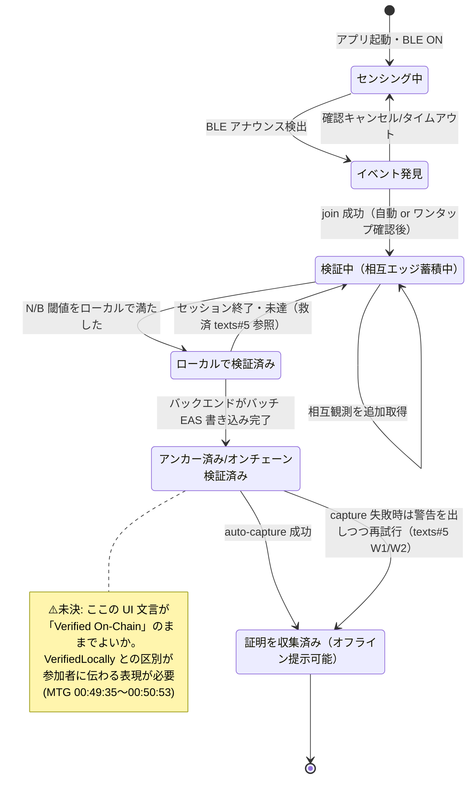

# beid 運用フロー（ドラフト v0.1）

> **位置づけ**: 2026-07-10 黙々会の叩き台として AI エージェント（flow-docs）が作成したドラフトです。決定事項として書かれているものは 2026-07-09 定例 MTG の議事録（[[journal/2026-07-09-levarac-mtg-minutes]]、以下「MTG議事録」）に根拠を持ちます。それ以外は texts リポジトリの設計叩き台・barnard spike ブランチからの引用、または本ドラフト作成者の提案であり、**チームの決定ではありません**。文中 ⚠️未決 は明示的に未確定な箇所です。加筆・削除・修正を前提にしています。
>
> **参照元**: MTG議事録 / Levarac 用語集(`kura/projects/levarac/glossary.md`) / whitepaper(`levarac/texts` `whitepaper/whitepaper.md`) / texts 設計叩き台 issue #2「eventAuth 受付発行フロー v1」・issue #5「false negative の救済経路」/ meissa-facilitator README / barnard `spike/eventcode-discovery` ブランチ `docs/spike-eventcode-discovery.md`。

---

## 0. 決定事項サマリ（このフローが前提とするルーリング）

MTG議事録の決定事項のうち、本フローの骨格になっているものだけ抜粋します（全文は議事録参照）。

| # | ルーリング | 本フローへの反映箇所 |
|---|---|---|
| 1 | beid は「相互センシング」機能に絞り込む。挨拶要素は削除 | 2.3 センシングのみを扱う。あいさつアプリ的な UX は対象外 |
| 2 | AA は不採用。通常の WalletConnect ログイン | 2.1 参加者の鍵まわりに AA は登場しない |
| 5 | オンチェーン書き込みはユーザーでなくバックエンドが代行。**時間ウィンドウ単位でグラフデータのハッシュ値をバッチ書き込み**。イベント登録・トークンクレームの窓口はプロトコルコントラクトとして分離するが、正式クレーム機能は別レーンでよい | 2.4 ファイナライズはバックエンドが主体。2.6 クレームは別レーンとして分離して記述 |
| 6 | 複数日イベントは日ごとのグラフをプロトコルレベルで統合しない | 2.4 の注記、複合バッジは主催者裁量として scope 外 |
| — | 信頼モデルは whitepaper の早い章で「妥協点」として明文化する方針 | 本フローでは whitepaper §5（Threat model and staged trust）への参照で代替し、本書では再定義しない |

---

## 1. 全体像

このフローは**運用（人手作業）が多いことを前提に、あえて人手の部分を隠さず可視化する**ために作られています（MTG議事録 宿題「業務フロー図の整理」、`01:14:12`〜）。ETHGlobal 等での説明資料としての転用も想定。

---

## 2. フェーズ別詳細

### 2.1 イベント登録

| | 内容 |
|---|---|
| **登場人物** | 主催者 |
| **デバイス上 / バックエンド** | 主催者がイベントを作成（イベントID、`EventCode`、N閾値などの `thresholdParams` を設定）。バックエンドがイベントレコードを作成し、そのイベントの authority 鍵（EAS に pin される鍵、whitepaper §3.4）を紐付ける |
| **人手作業** | 主催者が N 閾値・イベント時間枠・複数日か単日かを決める。`EventCode` の配布方法を決める（会場入口ポスター等の準公開が texts#2 の想定 — ⚠️未決、下記） |
| **失敗・救済** | — （この段階では参加者は未登場） |

⚠️未決:
- `EventCode` の配布方法は texts#2 で「会場入口ポスター等の準公開でよい、と仮定を明示する」とあるだけで、チームの決定事項ではありません。barnard の `spike/eventcode-discovery` は EventCode 手入力を不要にする代替（後述 2.3）を検討中で、採用されればここでの配布設計自体が変わります。
- 主催者向け画面（イベント登録の UI）のアーキテクチャは未決着（デリバラブル2 `organizer-console-brief.md` 参照）。

---

### 2.2 チェックイン（eventAuth 発行）

texts#2「eventAuth 受付発行フロー v1 設計」の推奨案（結論1）に基づく。**この案自体は draft for team review であり、まだ裁定されていません**が、task ブリーフの指定に従い本フローの主線として採用します。

| | 内容 |
|---|---|
| **登場人物** | 参加者、スタッフ（受付デスク）、（オプション）チケッティング連携システム |
| **デバイス上** | 参加者: `EventCode` を読み取り per-event 署名鍵を derive → 受付QR（`{v, eventIdHash, signPubKey, checkInToken?}`）を表示。 スタッフ端末: QR をスキャン → ローカルで重複照合（signPubKey / anchor 未登場か）→ desk key でローカル署名した `eventAuth` を発行 → 参加者へ返却（オンライン: push 2–3s / オフライン: response QR 5–8s） |
| **バックエンド** | オンライン時のみ関与（push 配送、共有ログとの照合）。**発行のクリティカルパスからサーバは意図的に外されている**（desk key 方式、texts#2 §根拠） |
| **人手作業** | スタッフが QR をスキャンし本人を目視する、という**1スキャン=1人の物理的操作**が Sybil 対策の実体（whitepaper §5.1「The check-in desk becomes part of the security boundary」）。リストバンドを「発行済み」の視覚マーカーとして併用する運用も想定 |
| **失敗・救済** | 発行直後に**発行時 liveness self-check**（texts#2 §5.7）を非同期実行 — BLE 権限・広告開始・報告レイヤーのテスト送信を自己診断し、失敗時は端末上で警告 + help desk 誘導。デスク通過はブロックしない（⚠️未決: blocking化の是非は ETHTokyo 2026 実測後に再判断、texts#2「未解決の問い3」）。この self-check は texts#5 が実測した「BLE は正常なのに報告APIが一度も発火しない」型の失敗（1/3 の端末で発生）を入口で捕まえるのが狙い |

⚠️未決:
- eventAuth 発行フロー自体が texts#2 の draft であり team review 前（本ドラフトが正典化するものではない）。
- 発行時 liveness self-check を **デスク通過のブロッキング条件にするか**（texts#2 未解決の問い3）。
- desk key 失効の運用（スタッフ端末紛失時、一括 revoke か個別審査か。texts#2 未解決の問い4）。
- walk-in（チケット連携なし）イベントでの「1人1回」の強度をどう主催者ガイドに明記するか（texts#2 未解決の問い2）。

---

### 2.3 センシング（自動参加・相互観測）

| | 内容 |
|---|---|
| **登場人物** | 参加者（複数）、主催者（BLE アナウンス発信の主体） |
| **デバイス上** | 参加者端末が RPID をブロードキャスト・スキャンし、相互に検知した観測を署名して保持。detection ページに入ると自動でセンシング開始（MTG議事録 `00:39`〜`01:00` のデザインレビュー内容） |
| **バックエンド** | 基本的に非関与（センシング自体はオフラインで完結する BLE-native の設計。meissa-facilitator README「the detection path deliberately doesn't need it」） |
| **人手作業** | 理想は「アプリを開くだけ」。ただし barnard spike の推奨に従う場合、イベント検出の一瞬だけ人手（ワンタップ確認）が入る（下記） |

**イベント発見（EventCode レス join）**: barnard `spike/eventcode-discovery` は「手入力の EventCode をなくす」ための実験で、次の2案を比較しています。

1. **完全サイレント自動参加**（spike のプロトタイプ本体）: 主催者端末が GATT 経由でアナウンス（`eventId` + `eventCode` + 有効期限）を配信 → 参加者端末がスキャン・読取り・検証して自動的に `joinEvent()` を呼ぶ。人手ゼロ。
2. **ワンタップ確認**（spike が**本番導入の推奨**として提示、spike自体はこちらを実装していない）: 同じワイヤーフォーマットだが、参加者UIに「`<eventId>` に参加しますか？主催者が近くにいます」の確認を挟んでから join。なりすましイベントの誤 join を人が気づける形にする。

> task ブリーフでは「auto-join per the spike's one-tap-confirm shape」と指定されているため、本フローの主線図では**ワンタップ確認版**を採用しています。

⚠️未決:
- **ワンタップ確認 vs 完全サイレント自動参加のどちらを採用するかはチーム裁定が済んでいません。** spike ドキュメント自身が「a judgment call for the team, not something this spike settles」と明記しています。完全サイレント版の方が UX は良いですが、spoofed announcement（主催者になりすましたイベント広告）への対抗策を欠きます。
- spike は `spike/eventcode-discovery` ブランチにあり、**merge 予定はまだありません**（ブランチ先頭に "Not for merge" 表記）。
- 主催者側のアナウンス発信ロール（BLE peripheral advertise）をどのアプリ面で担うかは、デリバラブル2（`organizer-console-brief.md`）の論点と直結します — native アプリでないと BLE peripheral advertise は事実上できません。

---

### 2.4 ファイナライズ／アテステーション

| | 内容 |
|---|---|
| **登場人物** | バックエンド（indexer / facilitator）のみ。参加者・スタッフは不関与 |
| **デバイス上** | なし（この段階はバックエンド処理） |
| **バックエンド** | 1) 参加者から集めた署名済み観測を集約し有向グラフを復元（whitepaper §3.3）。2) 署名済み witness bundle と3つの Merkle root（participants / observations / results）を構築。3) bundle を EIP-4844 blob に載せる。4) `EventGraphCommitment`（`eventIdHash / protocolVersion / participantRoot / observationRoot / resultRoot / bundleDigest / blobVersionedHashes[] / challengeWindowStart/End / thresholdParamsHash`、Levarac用語集参照）を EAS に書き込む。**この EAS 書き込みはユーザーでなくバックエンドが代行し、時間ウィンドウ単位でバッチ実行する**（MTG議事録 決定5） |
| **人手作業** | 原則ゼロ（自動処理）。ただし「発行数 vs 実入場者数の突合」（texts#2 §5.4 の確定時 sanity check）は主催者/運営の目視確認が想定される |
| **失敗・救済** | クライアント側は finalization 通知を受けて **auto-capture** を試行（whitepaper §3.5）。失敗時はローカル通知（texts#5 (e) W1〜W2、window close 7/3/1日前の段階警告） |

複数日イベントの扱い（MTG議事録 決定6）: **日ごとに独立した相互センシンググラフを持ち、プロトコルレベルでは統合しない**。Day1+Day3 のような複合バッジ（トロフィー的仕組み）は主催者裁量の上位機能であり、プロトコルのコア機能としては扱わない。したがって本フロー図の「4. ファイナライズ」は**イベント（=1日）単位で独立に繰り返される**ものとして読んでください。

⚠️未決:
- バッチ書き込みの「時間ウィンドウ」の具体的な単位（1イベント1回か、複数イベントをまとめて日次バッチか）は MTG議事録に明記なし。
- ファイナライズのトリガー（イベント終了時刻での自動発火か、主催者の手動トリガーか）は未確定 — デリバラブル2「finalization trigger」の論点。

---

### 2.5 チャレンジウィンドウ

| | 内容 |
|---|---|
| **登場人物** | 第三者検証者（誰でも）、主催者（supersede の主体） |
| **デバイス上/バックエンド** | blob が公開されている約18日間、誰でも証拠をダウンロードして root を再計算し署名を検証できる（whitepaper §3.4）。異議がある場合、Merkle proof を伴う **challenge**（機械検証可能な不正の指摘）を提出可能 |
| **人手作業** | 通常は不要。challenge が成立した場合のみ主催者が訂正版 commitment で supersede |
| **失敗・救済** | **appeal**（人間の裁定を要する救済、texts#5）は challenge とは別レーン。texts#5 のルーティングルール: 「提出済みの署名観測が bundle に無い」ことを示す証拠（receipt）がある場合は challenge、それ以外の正直な取りこぼし（相互エッジ僅差・片方向のみ等）は appeal として主催者が裁定する |

texts#5 の救済3階層（本ドラフトでの要約。詳細は texts#5 原文）:

| Tier | 条件 | 救済可否 |
|---|---|---|
| Tier 1 | 相互エッジは一部あるが僅差不足 | 救済可（スタッフ attestation で不足1枠まで補完可） |
| Tier 2 | 相互エッジゼロだが片方向のみ観測あり（申告レイヤー沈黙型） | 救済可（`A-appeal` として Class A とは別区分で発行） |
| Tier 3 | どの方向にも観測なし | **観測 evidence 由来の credential は発行しない**（主催者は Lean profile の testimony record は発行してよいが出席「証明」ではない） |

⚠️未決:
- appeal の裁定 UI・運用フローはまだ設計段階（texts#5 は「叩き台」段階、team review 前）。
- Tier 2（片方向のみ）の appeal credential を benefit 配布側がどう扱うべきかのガイドライン未確定（texts#5 未解決の問い2）。
- appeal 証拠パッケージの自動組成に必要な `meissa#91`（参加者が自分の観測データを読み出す機能）は未実装（texts#5「実装依存」節）。

---

### 2.6 クレーム（別レーン）

MTG議事録 決定5: **「イベント登録・トークンクレームの窓口はプロトコルコントラクトとして分離するが、正式クレーム機能は別レーンとして作ってよい」**。

| | 内容 |
|---|---|
| **登場人物** | 参加者（credential 保持者）、検証者（verifier / benefit 配布側） |
| **デバイス上** | 参加者端末が finalization 時に auto-capture した credential を保持。提示時は self-proof（アカウント鍵 + per-event鍵の二重署名、whitepaper §3.5）をその場で生成 |
| **バックエンド/チェーン** | クレーム提示の検証はオフラインで完結（オンチェーンの root + captured artifact のみで足りる、whitepaper §3.5「Verification is fully offline」）。**正式クレーム機能**（トークン/NFT の実際の mint・配布ロジック）は本フローの主線とは別に実装してよい、というのが決定5の趣旨 |

⚠️未決:
- 「正式クレーム機能」の具体的な設計（何を mint するか、どのコントラクトが受け皿になるか）は MTG議事録に一切記載がなく、**未着手**です。本ドラフトはこれを空白のまま「別レーン」の箱としてのみ示しています。texts 側にも対応する issue はまだ確認できていません（要 issue 起票）。

---

## 3. シーケンス図

### 3.1 登録 → チェックイン → センシング

### 3.2 ファイナライズ → チャレンジウィンドウ → クレーム

---

## 4. 証明のライフサイクル（参加者端末側の状態遷移）

「Verified On-Chain」というステータス表記が、署名フローや状態遷移の設計が詰まっていないまま UI に出ていることが MTG で指摘されました（議事録 `00:49:35`〜`00:50:53`、保留・持ち越し論点）。以下は本ドラフトが提案する状態モデルで、**この図自体が UI 文言確定のための叩き台**です。

状態の対応関係（本ドラフトの整理、要チーム確認）:

| 状態 | 対応するプロトコル上の事実 | 備考 |
|---|---|---|
| Sensing | RPID ブロードキャスト・スキャン中 | §2.3 |
| EventFound | BLE アナウンス検出、join 前 | ⚠️未決の一タップ確認 UI がここに乗る |
| Verifying | 相互観測を蓄積中、まだ result root に含まれていない | ローカルの生データのみに基づく暫定状態 |
| VerifiedLocally | 端末側でN/B閾値を満たしたと判定 | **オンチェーンにはまだ反映されていない** — ここと次状態の呼称の区別が UI 課題の核心 |
| AnchoredOnChain | バックエンドのバッチ書き込みにより EventGraphCommitment が EAS に確定 | チャレンジウィンドウが開始 |
| Collected | credential を auto-capture 済み、オフラインで提示可能 | whitepaper §3.5 の「captured artifact」 |

⚠️未決（この章全体）:
- 状態名・UI 文言そのもの（"Verified On-Chain" を含む）はチーム未決定。本図はあくまで叩き台。
- `VerifiedLocally` から `AnchoredOnChain` に遷移しないケース（バッチウィンドウを逃す、finalization トリガーの仕様未確定 — §2.4 参照）のハンドリングが未設計。
- チャレンジで supersede が起きた場合の逆行遷移（`AnchoredOnChain` → 再 `Verifying`）をこの図には含めていない。texts#5 の appeal（A-appeal）が別区分の credential として並走する扱いも UI 上どう見せるか未設計。

---

## 5. 未決事項まとめ（⚠️未決 一覧）

| # | 論点 | 参照 | 次の一歩 |
|---|---|---|---|
| 1 | WalletConnect `personal_sign` 制約を踏まえた署名検証方式の最終設計 | MTG議事録 `00:17:38`〜`00:21:09`（明示的に先送り） | 仮決めのまま実装着手可、正式化は別途 |
| 2 | ガス代の肩代わり（誰がいつ負担するか） | MTG議事録 `00:54:19`〜`00:56:34` | 未着手 |
| 3 | EventCode レス join（完全サイレント自動参加 vs ワンタップ確認） | barnard `spike/eventcode-discovery`「a judgment call for the team」 | チーム裁定が必要。spike は merge 予定なし |
| 4 | 「Verified On-Chain」等の UI 状態文言・遷移 | MTG議事録 `00:49:35`〜`00:50:53`、本書 §4 | 本ドラフトの状態図をたたき台に UI チーム/デザインで確定 |
| 5 | eventAuth 発行フロー（texts#2）そのものの team review | texts#2 Status: draft for team review | レビュー予定なし・要スケジューリング |
| 6 | 発行時 liveness self-check の blocking 化 | texts#2 未解決の問い3 | ETHTokyo 2026 実測後に再判断 |
| 7 | desk key 失効運用（一括 revoke か個別か） | texts#2 未解決の問い4 | 未着手 |
| 8 | walk-in イベントでの「1人1回」強度の免責文言 | texts#2 未解決の問い2 | 未着手 |
| 9 | appeal の Tier2（片方向のみ）credential の benefit 配布側ガイドライン | texts#5 未解決の問い2 | 未着手 |
| 10 | appeal 証拠自動組成の実装依存（`meissa#91`） | texts#5「実装依存」節 | meissa側の実装着手が前提 |
| 11 | ファイナライズのトリガー（自動 or 主催者手動）とバッチ「時間ウィンドウ」の単位 | MTG議事録 決定5、本書 §2.4 | 未着手。デリバラブル2の finalization touchpoint とも関連 |
| 12 | 「正式クレーム」機能の設計そのもの | MTG議事録 決定5（別レーンでよい、とのみ言及） | 未着手・texts への issue 起票が必要 |
| 13 | 主催者向け画面のアーキテクチャ（イベント登録・eventAuth発行・監視・ファイナライズトリガー・救済対応の窓口） | MTG議事録 宿題 `01:38:47`〜`01:40:51` | デリバラブル2 `organizer-console-brief.md` 参照 |

---

## 出典と齟齬メモ

- task ブリーフは「auto-join per the spike's one-tap-confirm shape」と指定しているが、barnard spike ドキュメント自身は**完全サイレント自動参加を実装し、ワンタップ確認は"推奨"に留めている**（実装 ≠ 推奨、という食い違いがある）。本書は task ブリーフの指定通りワンタップ確認を主線図に採用しつつ、§2.3 と §3.1 で両案を併記し、未裁定であることを明記した。
- MTG議事録は「トラストモデルを whitepaper の早い章で明文化」と決定しているが、これは whitepaper 自体の構成に関するルーリングであり、本運用フロードキュメントの構成には直接の指示がない。本書では whitepaper §5 への参照に留め、トラストモデルの再定義はしていない。
- texts#2・texts#5 はいずれも "draft for team review" ステータスであり、MTG議事録には両文書のレビュー結果への言及がない。したがって本書が「決定事項」として扱えるのは MTG議事録に明記された項目のみで、texts#2/#5 の個々の推奨（desk key 方式、appeal 3階層など）はすべて **未裁定の叩き台**として扱っている。
